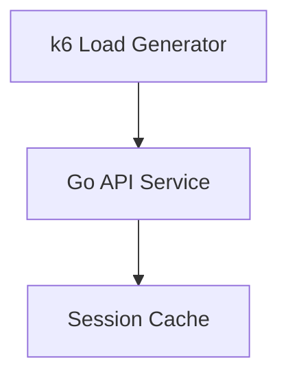

# Architecture

## Objective
Define the high-level architecture for services.

## Components
### Go API Service
Handles: 
- Authentication
- Registration
- Session validation
- User data retrieval

### Session Cache
Stores:
- Session state
- Authentication-related temporary data

### k6 Load Generator
Simulates:
- Distributed spike traffic
- Authentication and session workloads

## Planned Future Improvements
- Autoscaling
- Enhanced observability
- Infrastructure hardening