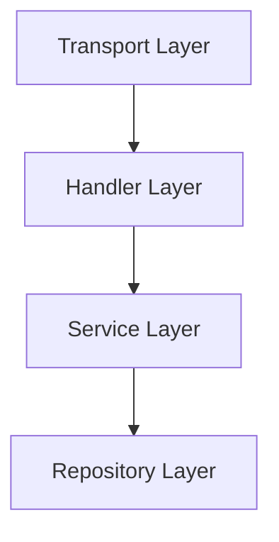

# ADR-005: Adopt Clean Architecture Layering

## Status
Accepted

## Context
The project requires:
- Separation of concerns
- Clear dependency boundaries
- Easier unit testing
- Iterative scalability improvements
- Flexible transport and infrastructure evolution

## Decision
Adopt layered Clean Architecture structure consisting of:
- Transport layer
- Handler layer
- Service layer
- Repository layer

Dependencies must flow inward. Higher-level layers must not depend on transport or infrastructure implementation details.

Dependency Direction:

## Consequences

### Positive
- Improved maintainability
- Easier unit testing
- Clear separation of responsibilities
- Easier future infrastructure replacement
- Better scalability for iterative development

### Negative
- Additional abstraction layers
- Increased boilerplate for small features
- More dependency wiring required