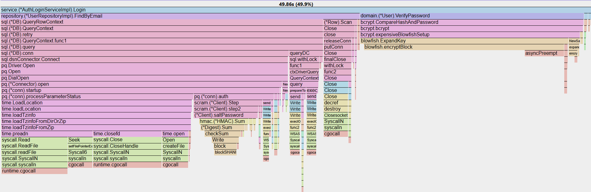
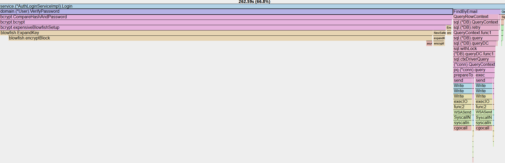

# ADR-007: Adopt 18 Max Idle and 18 Max Open for Database Connection Size

## Status
Accepted

## Context
After integrating with PostgreSQL as persistence layer, the throughput is dropping and latency is spiking dramatically.
```bash
    ✓ 'p(50)<50' p(50)=8.06ms
    ✗ 'p(95)<100' p(95)=721.94ms
    ✗ 'p(99)<250' p(99)=957.6ms
    ✗ 'rate<0.01' rate=1.27%
    checks_total.......................: 22961  752.801896/s
```

Therefore, profiling with pprof becomes viable and judging from the CPU profile's flamegraph below, can be interpreted that CPU spends more time on `sql.(*DB).conn` rather than the query itself. Which means the bottleneck right now is at FindByEmail (Database Connection) and not query or bcrypt.


## Decision
So, the solution is to re-use database's connection by specifying Max Idle and Max Open.
Before picking 18 Max Idle and 18 Max Open, several alternatives have been profiled as well.

18 Max Idle, 18 Max Open result:
```bash
    ✓ 'p(50)<50' p(50)=15.12ms
    ✓ 'p(95)<100' p(95)=40.02ms
    ✓ 'p(99)<250' p(99)=55.71ms
    ✓ 'rate<0.01' rate=0.00%
    checks_total.......................: 258830  8623.285779/s
```

90 Max Idle, 90 Max Open result:
```bash
    ✓ 'p(50)<50' p(50)=15.06ms
    ✓ 'p(95)<100' p(95)=41.57ms
    ✓ 'p(99)<250' p(99)=57.61ms
    ✓ 'rate<0.01' rate=0.00%
    checks_total.......................: 253229  8437.408218/s
```

Note: the result of benchmark may vary depending on CPU state and data that available on database at that time.

But, based on profiling that have been done, by using 90 Max Idle and 90 Max Idle only get diminish return (1.2%~)
```bash
18 Conn:
(pprof) top -cum
Active filters:
   show=FindByEmail
Showing nodes accounting for 24.80s, 6.30% of 393.34s total
      flat  flat%   sum%        cum   cum%
    24.80s  6.30%  6.30%     24.80s  6.30%  github.com/Highload-Labs/healthcare-gov-backend/internal/repository.(*UserRepositoryImpl).FindByEmail
    
90 Conn:
(pprof) top -cum
Active filters:
   show=FindByEmail
Showing nodes accounting for 17.73s, 5.09% of 348.37s total
      flat  flat%   sum%        cum   cum%
    17.73s  5.09%  5.09%     17.73s  5.09%  github.com/Highload-Labs/healthcare-gov-backend/internal/repository.(*UserRepositoryImpl).FindByEmail
```

Result table of profiling that have been done:

| Pool  | Throughput | p95  | p99   |
|-------|------------|------|-------|
| 1/1   | 4.5k rps   | 96ms | 150ms |
| 5/5   | 7.96k rps  | 52ms |  81ms |
| 18/18 | 8.6k rps   | 40ms | 55ms  |
| 90/90 | 8.4k rps   | 41ms | 57ms  |

The reason of 18/18 pool has better rps and latency than 90/90 is because the bottleneck no longer the database connection. The bottleneck has been changed into Bcrypt, so throughput now highly relative of cpu state.


## Consequences
### Positive
- Optimal resource usage
- Preventing thundering herd
- Shifts the bottleneck to computational work (Bcrypt) rather than wasteful network handshakes

### Negative
- Slightly higher (1.2%~) p95 latency than 90/90 in absolute raw peaks, but arguably more stable
- If the business logic ever changes to be less CPU-intensive (e.g., removing Bcrypt), 18 may become the new bottleneck again, requiring a revisit of this ADR