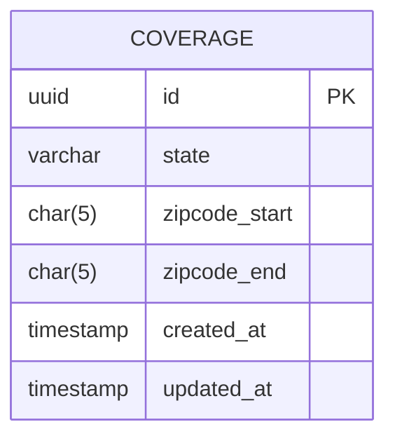

# Coverage

```mermaid
erDiagram
    COVERAGE
    COVERAGE {
        uuid id PK
        varchar state
        char(5) zipcode_start
        char(5) zipcode_end
        timestamp created_at
        timestamp updated_at
    }
```