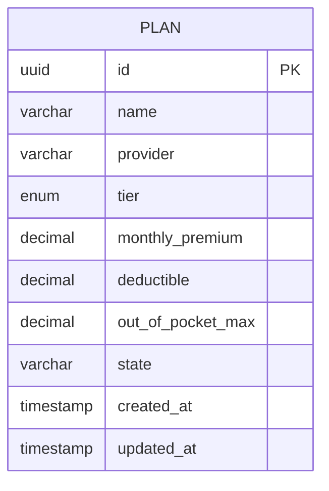

# Plan

Note:
- Monthly Premium is the monthly subscription that customer needs to pay
- Deductible is the threshold before insurance starts sharing-cost
- Out of Pocket Max is the maximum amount customer needs to spent before insurance provider covers it 100%

## Tier Enum
Bronze, Silver, Gold, Platinum